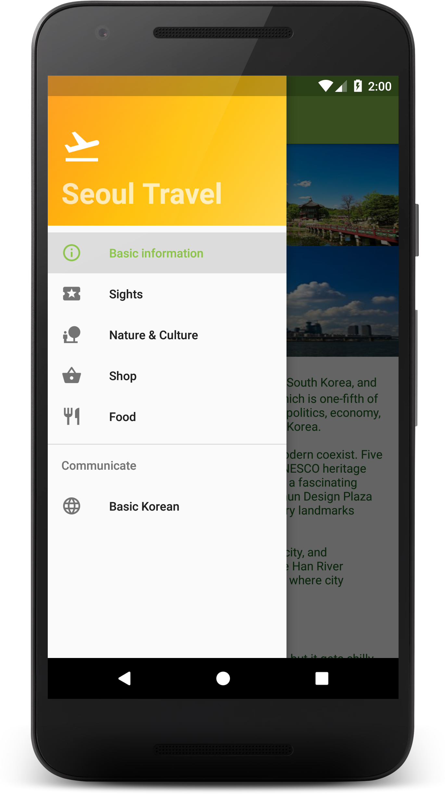
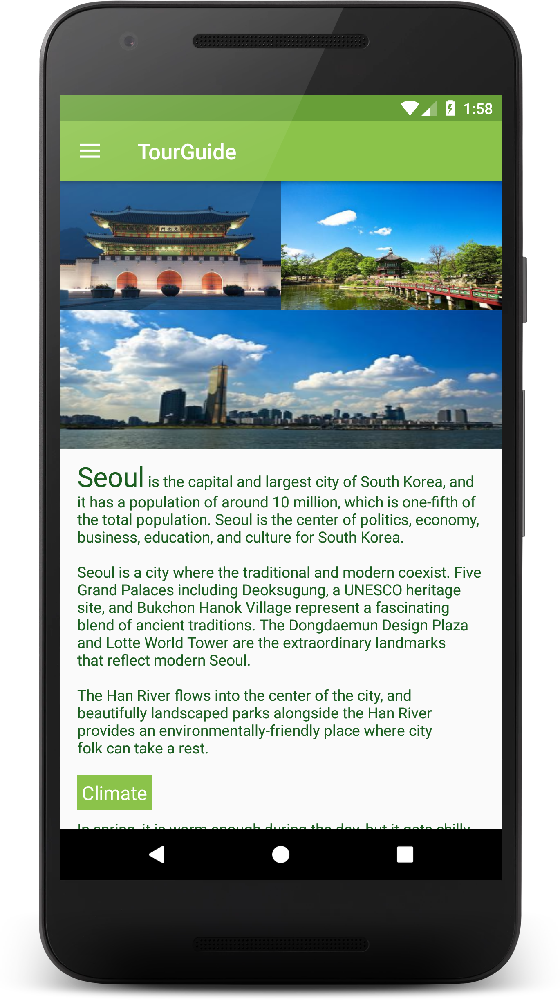
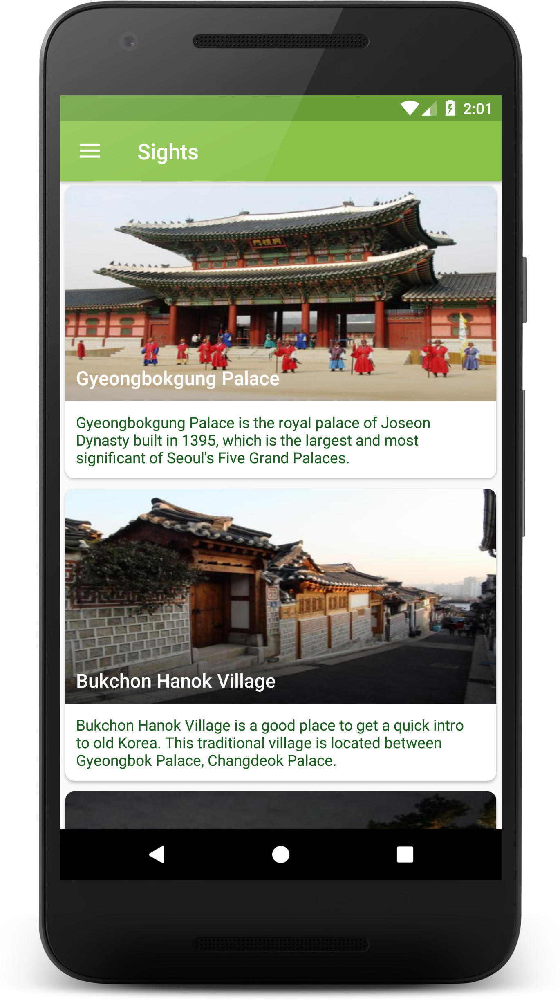

# Tour Guide App
Project as a part of Android Basics by Google Nanodegree at Udacity.

## Projet Overview
The goal is to create a Tour Guide App which presents relevant information to a user who’s visiting your city. The app can list top attractions, restaurants, public places, or events for the city. It can contain all the best known secrets that only locals know. It’s up to you which categories you want to provide, as well as what information to provide in each category.

## Why this project?
In the most recent portion of the Nanodegree program, you worked to build the Miwok language app, which taught you how to present information in a multi-screen app to your users. Now, you will practice that skillset by presenting information that you care about in your own life to a user. Your Tour Guide app will be unique to your city, your life, and your interests.

## What I learned
* Planning your app design and navigation before coding
* Selecting proper data structures to store lists of information
* Building layouts to display those lists of data
* Navigating between lists in Fragments using Navigation Drawer
* Creating your own custom classes
* Properly handling images or audio

## Features
* Navigation Drawer
* Fragments
* RecyclerView
* CardView
* MediaPlayer
* AudioManager
* Intent

## Video
Click [here](https://youtu.be/JYXlQqXe3SY) to see a video demonstrating the app.

## Screenshots


## Authors
This app contains Creative Commons images.<br/>
[Photo](https://commons.wikimedia.org/wiki/File:Area_west_of_Bukchon_Hanok_Village_B.JPG) by Sakaori
/ [CC BY-SA 3.0](https://creativecommons.org/licenses/by-sa/3.0/)<br/>
[Photo](http://blog.naver.com/storyphoto/viewer.jsp?src=https%3A%2F%2Fblogfiles.pstatic.net%2FMjAxNzA0MTlfMTY5%2FMDAxNDkyNTI5NzUzODAy.Z38a62nCWWThr0Qf-GfLaFZpdQAsoR8_wXJdO3jVZ20g.Bijv-qaPbxrwEgI1rZiwUj7F3CsJqgsNiYC_6DqeL8Ug.JPEG.7lovei%2Fimage_3285799211492528003688.jpg) by Cho Injeong / [CC BY-NC-ND 2.0](https://creativecommons.org/licenses/by-nc-nd/2.0/)<br/>
[Photo](https://commons.wikimedia.org/wiki/File:Korea-Seoul-Bongeunsa-01.jpg) by Gaël Chardon 
/ [CC BY-SA-2.0](https://creativecommons.org/licenses/by-sa/2.0/)<br/>
[Photo](https://www.flickr.com/photos/nestorlacle/13461827735) by Nestor Lacle 
/ [CC BY 2.0](https://creativecommons.org/licenses/by/2.0/)<br/>
[Photo](https://commons.wikimedia.org/wiki/File:Front_view_of_national_museum_of_korea.jpg) by Jinah78 
/ [CC BY-SA 3.0](https://creativecommons.org/licenses/by-sa/3.0/)<br/>
"Grevin Museum" by Haerin is licensed under [CC BY-NC-ND 2.0](https://creativecommons.org/licenses/by-nc-nd/2.0/)<br/>
[Photo](https://commons.wikimedia.org/wiki/File:Korea-Seoul-National.folk.museum-01.JPG) by Isaac Crum 
/ [CC BY-SA 3.0](https://creativecommons.org/licenses/by-sa/3.0/)<br/>
[Photo](https://blog.naver.com/jmh7738/220766764319) by Miho 
/ [CC BY-NC-ND 2.0](https://creativecommons.org/licenses/by-nc-nd/2.0/)<br/>
[Photo](https://www.flickr.com/photos/bcgovphotos/11136687804) by Province of British Columbia 
/ [CC BY-NC-SA 2.0](https://creativecommons.org/licenses/by-nc-sa/2.0/)<br/>
[Photo](https://commons.wikimedia.org/wiki/File:JamsilBP.gif) by Kosaf000 
/ [CC BY-SA-4.0](https://creativecommons.org/licenses/by-sa/4.0/)<br/>
[Photo](http://www.cynic.org.uk/photos/Korea2016/index2.html) by Robin Stevens 
/ [CC BY-NC-ND 2.0](https://creativecommons.org/licenses/by-nc-nd/2.0/)<br/>
[Photo](https://blog.naver.com/pinah_08/220489309654) by pinah_08 
/ [CC BY-NC-ND 2.0](https://creativecommons.org/licenses/by-nc-nd/2.0/)<br/>
[Photo](https://blog.naver.com/bizinfo1357/221126420036) by bizinfo1357 
/ [CC BY-NC-ND 2.0](https://creativecommons.org/licenses/by-nc-nd/2.0/)<br/>
[Photo](https://blog.naver.com/nuburi3/90167881130) by nuburi3 
/ [CC BY-NC-ND 2.0](https://creativecommons.org/licenses/by-nc-nd/2.0/)<br/>
[Photo](https://blog.naver.com/ssangkal63/220298107638)" by ssangkal63
/ [CC BY-NC-ND 2.0](https://creativecommons.org/licenses/by-nc-nd/2.0/)<br/>
[Photo](https://sora5517.blog.me/220942103629?Redirect=Log&from=postView) by Sora5517 
/ [CC BY-NC-ND 2.0](https://creativecommons.org/licenses/by-nc-nd/2.0/)<br/>
[Photo](https://blog.naver.com/dahliakim/220534057641) by dahliakim 
/ [CC BY-NC-ND 2.0](https://creativecommons.org/licenses/by-nc-nd/2.0/)<br/>
[Photo](http://blog.naver.com/storyphoto/viewer.jsp?src=http%3A%2F%2Fblogfiles.naver.net%2F20160208_181%2Fkr_jeju_1454923229579AncoC_JPEG%2F%25BF%25B5%25B5%25EE%25C6%25F7%25C5%25B8%25C0%25D3%25BD%25BA%25C4%25F9%25BE%25EE-9.jpg) by Kr_jeju 
/ [CC BY-NC-ND 2.0](https://creativecommons.org/licenses/by-nc-nd/2.0/)<br/>
[Photo](http://blog.naver.com/storyphoto/viewer.jsp?src=https%3A%2F%2Fblogfiles.pstatic.net%2FMjAxNjEyMThfMjM1%2FMDAxNDgyMDY3MDk1OTc0.HF9ZJ-t79RJmC47pbxJC3C9MVGuGQ07OTpiizDg_RkMg.Dr-u4eK3_dgJN6UU_8xR_NMufH5zkIUGyglZX6Lh010g.JPEG.dbffldksk86%2Fimage_457923801482066983653.jpg) by dbffldksk86 
/ [CC BY-NC-ND 2.0](https://creativecommons.org/licenses/by-nc-nd/2.0/)<br/>
[Photo](https://blog.naver.com/sweetdew_/220292759427) by sweet dew
/ [CC BY-NC-ND 2.0](https://creativecommons.org/licenses/by-nc-nd/2.0/)<br/>
"Manjok Ohyang Jokbal" by 030425 is licensed under [CC BY-NC-ND 2.0](https://creativecommons.org/licenses/by-nc-nd/2.0/)<br/>
[Photo](https://blog.naver.com/matziptongue/50143142018) by matziptongue
/ [CC BY-NC-ND 2.0](https://creativecommons.org/licenses/by-nc-nd/2.0/)<br/>
[Photo](https://blog.naver.com/rockview/220584791707) by rockview 
/ [CC BY-NC-ND 2.0](https://creativecommons.org/licenses/by-nc-nd/2.0/)<br/>
[Photo](https://blog.naver.com/cutejung1020/220486983767) by cutejung1020 
/ [CC BY-NC-ND 2.0](https://creativecommons.org/licenses/by-nc-nd/2.0/)<br/>
[Photo](https://blog.naver.com/niji486/220620524250) by niji486 
/ [CC BY 2.0](https://creativecommons.org/licenses/by/2.0/)<br/>
[Photo](https://blog.naver.com/dh_planet/220992743627) by dh_planet 
/ [CC BY-NC-ND 2.0](https://creativecommons.org/licenses/by-nc-nd/2.0/)<br/>
[Photo](https://blog.naver.com/boramdoll/221070390765) by boramdoll 
/ [CC BY-NC-ND 2.0](https://creativecommons.org/licenses/by-nc-nd/2.0/)<br/>

```
MIT License

Copyright (c) 2018 Soojeong Shin

Permission is hereby granted, free of charge, to any person obtaining a copy
of this software and associated documentation files (the "Software"), to deal
in the Software without restriction, including without limitation the rights
to use, copy, modify, merge, publish, distribute, sublicense, and/or sell
copies of the Software, and to permit persons to whom the Software is
furnished to do so, subject to the following conditions:

The above copyright notice and this permission notice shall be included in all
copies or substantial portions of the Software.

THE SOFTWARE IS PROVIDED "AS IS", WITHOUT WARRANTY OF ANY KIND, EXPRESS OR
IMPLIED, INCLUDING BUT NOT LIMITED TO THE WARRANTIES OF MERCHANTABILITY,
FITNESS FOR A PARTICULAR PURPOSE AND NONINFRINGEMENT. IN NO EVENT SHALL THE
AUTHORS OR COPYRIGHT HOLDERS BE LIABLE FOR ANY CLAIM, DAMAGES OR OTHER
LIABILITY, WHETHER IN AN ACTION OF CONTRACT, TORT OR OTHERWISE, ARISING FROM,
OUT OF OR IN CONNECTION WITH THE SOFTWARE OR THE USE OR OTHER DEALINGS IN THE
SOFTWARE.

```
